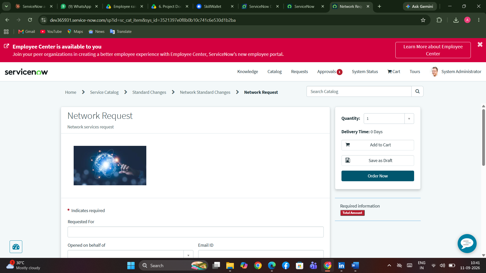
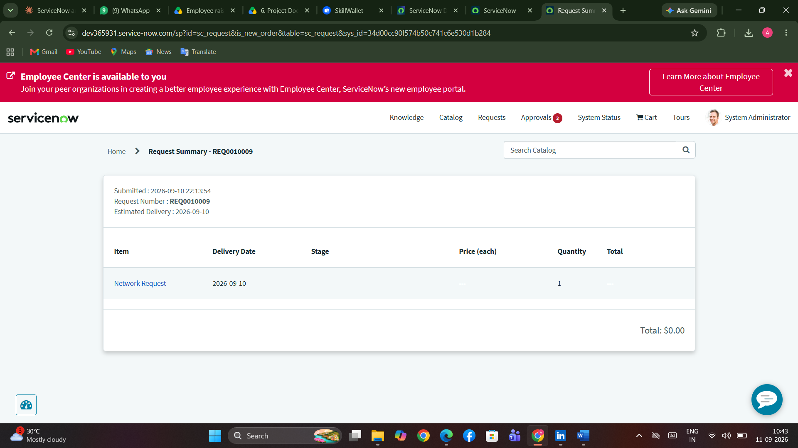
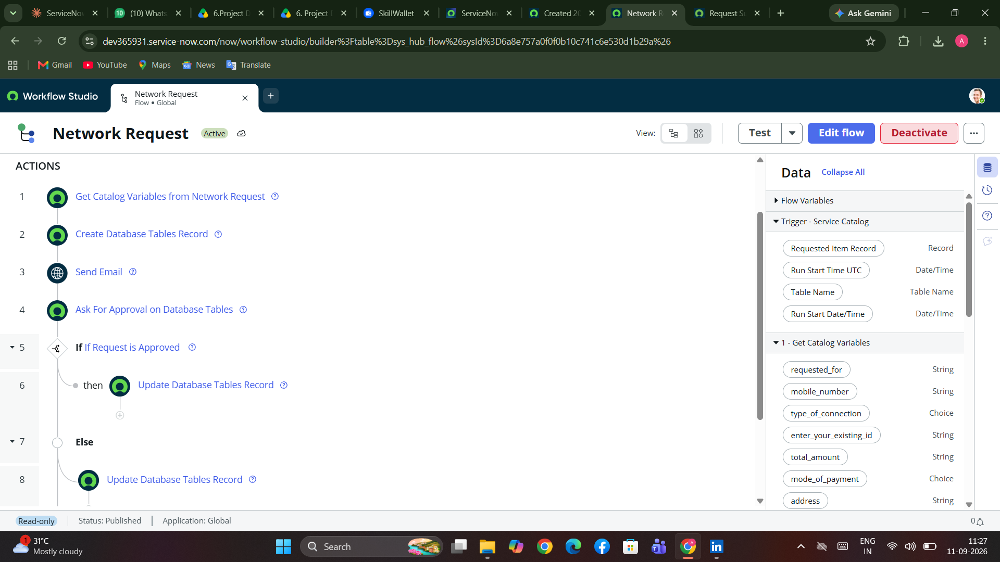
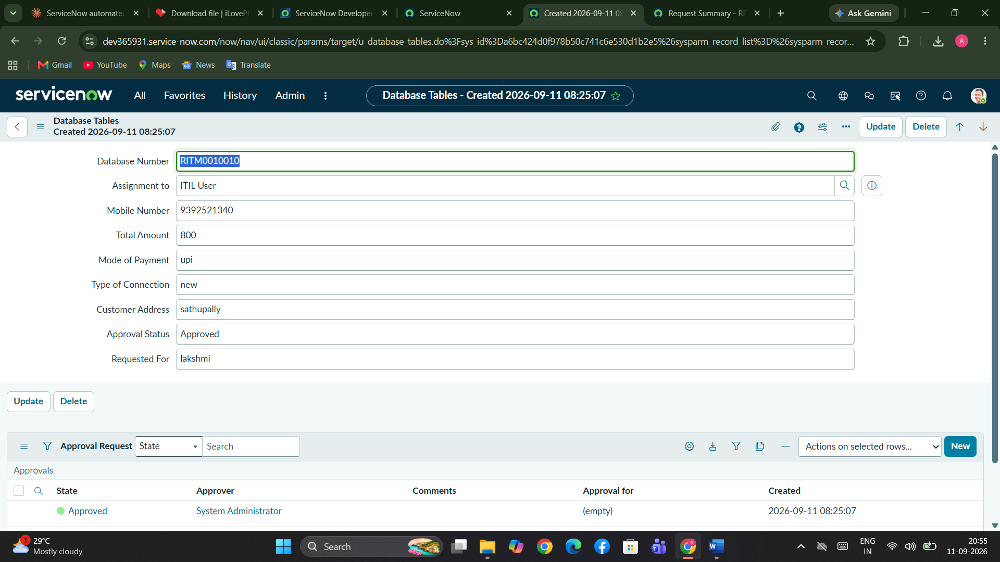
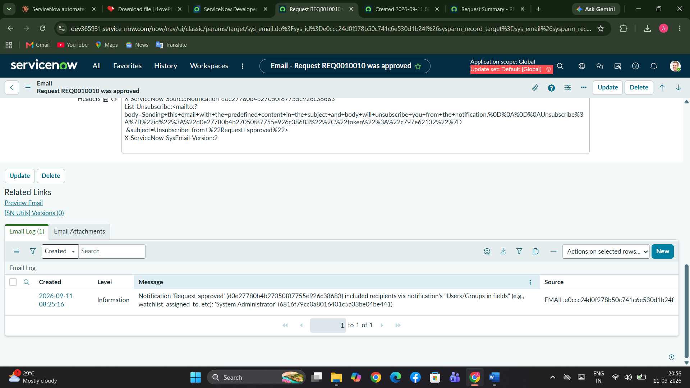

<div align="center">

# 🌐 Automated Network Request Management

### End-to-End ServiceNow Request Automation using Service Catalog, Flow Designer, and Native Approval Engine


</div>

---

# 📖 Table of Contents

- [Project Overview](#-project-overview)
- [Problem Statement](#-problem-statement)
- [Solution Features](#-solution-features)
- [Technology Stack](#-technology-stack)
- [Solution Architecture](#-solution-architecture)
- [Data Model](#-data-model)
- [Project Development](#-project-development)
- [Project Repository Structure](#-project-repository-structure)
- [Security](#-security)
- [Testing](#-testing)
- [Getting Started](#-getting-started)
- [Future Enhancements](#-future-enhancements)
- [Author](#-author)

---

# 🧭 Project Overview

Automated Network Request Management is a ServiceNow-based solution that digitizes and automates the complete lifecycle of employee network service requests.

Traditionally, network requests are handled through emails, phone calls, and spreadsheets, making tracking and approvals difficult. This project replaces that manual process with a centralized ServiceNow workflow where employees can:

- Submit network requests through a Service Catalog item
- Track request progress
- Receive automated notifications
- Obtain approval through ServiceNow's native approval engine
- Maintain complete request visibility

The solution is built entirely using native ServiceNow capabilities without custom scripting.

### Key Objective

To automate request intake, approval routing, status tracking, and requester notifications using ServiceNow's low-code/no-code platform.

---

# 🎯 Problem Statement

## Employee Perspective

- No structured mechanism to submit network requests
- Difficult to track request progress
- No visibility into approval status

## IT Team Perspective

- Requests handled through emails and spreadsheets
- Manual approval tracking
- Increased chances of missed requests and delays

---

# ✨ Solution Features

✅ Service Catalog based Network Request form

✅ Reusable Request Information Variable Set

✅ Dynamic field visibility using Catalog UI Policy

✅ Flow Designer automation

✅ Custom request tracking table

✅ Native ServiceNow Approval Engine integration

✅ Automated Email Notifications

✅ Role-Based Access Control (ACLs)

✅ End-to-End Request Tracking

---

# 🛠 Technology Stack

| Component | Technology |
|------------|------------|
| Platform | ServiceNow |
| Request Intake | Service Catalog |
| Portal | Service Portal |
| Workflow Automation | Flow Designer |
| Approval Management | Native Approval Engine |
| Security | ACLs & Roles |
| Database | Custom Table (u_database_tables) |
| Notifications | Email Notifications |

---

# 🏗 Solution Architecture

```text
Employee
    │
    ▼
Service Portal
    │
    ▼
Network Request Catalog Item
    │
    ▼
Flow Designer
 ├─ Get Variables
 ├─ Create Record
 ├─ Send Email
 ├─ Ask For Approval
 └─ Update Status
    │
    ▼
Database Tables
    │
    ▼
Approver
    │
    ▼
Approved / Rejected
    │
    ▼
Notification Sent
```

---

# 🗄 Data Model

### Custom Table

**Database Tables (`u_database_tables`)**

| Field | Type |
|---------|---------|
| Database Number | Auto Number |
| Requested For | String |
| Assignment To | Reference |
| Mobile Number | String |
| Total Amount | String |
| Mode Of Payment | Choice |
| Type Of Connection | Choice |
| Customer Address | String |
| Approval Status | String |

---

# 🚀 Project Development

## 1️⃣ Service Catalog Item

Employees submit requests through the Network Request catalog item available in the Service Portal.



---

## 2️⃣ Request Submission Summary

After submission, ServiceNow generates a request summary and tracking number.



---

## 3️⃣ Flow Designer Workflow

The Flow Designer automates:

- Variable Retrieval
- Record Creation
- Email Notification
- Approval Routing
- Status Updates



---

## 4️⃣ Database Record Creation

Submitted requests are automatically stored in the custom Database Tables table.



---

## 5️⃣ Approval Email Notification

Once approved, automated notifications are sent to the requester.



---

# 📂 Project Repository Structure

```text
AUTOMATED NETWORK REQUEST MANAGEMENT
│
├── 1.Ideation Phase
│   ├── Empathy Map
│   ├── Problem Statements
│   └── Brainstorming & Idea Prioritization
│
├── 2.Requirement Phase
│   ├── Customer Journey Map
│   ├── Solution Requirements
│   ├── Data Flow Diagram
│   └── Technology Stack
│
├── 3.Project Design Phase
│   ├── Problem Solution Fit
│   ├── Proposed Solution
│   └── Solution Architecture
│
├── 4.Project Planning Phase
│   ├── Product Backlog
│   ├── Sprint Schedule
│   ├── Velocity Chart
│   └── Burndown Chart
│
├── 5.Project Development Phase
│   ├── UAT Report
│   ├── Functional Testing
│   └── Performance Testing
│
├── 6.Project Documentation
│   ├── FSD Documentation
│   └── Final Project Report
│
├── 7.Project Demonstration
│   └── Demonstration Video
│
└── screenshots
```

---

# 🔐 Security

### Custom Role

```text
u_database_tables_user
```

Implemented using:

- Table-Level ACLs
- Create Access
- Read Access
- Write Access
- Delete Access

No custom ACL scripting used.

---

# 🧪 Testing

### User Acceptance Testing

| Area | Result |
|--------|---------|
| Catalog Submission | ✅ Pass |
| UI Policy Validation | ✅ Pass |
| Record Creation | ✅ Pass |
| Approval Routing | ✅ Pass |
| Status Update | ✅ Pass |
| Email Notification | ✅ Pass |
| Access Control | ✅ Pass |

### Test Summary

- Functional Test Cases: 9
- Total Test Cases Executed: 37
- Pass Rate: 100%
- Defects Logged: 17
- Defects Resolved: Majority Fixed

---

# 🚀 Getting Started

### Prerequisites

- ServiceNow Personal Developer Instance (PDI)

### Deployment Steps

1. Download the Update Set XML.
2. Open ServiceNow.
3. Navigate to:

```text
System Update Sets → Retrieved Update Sets
```

4. Import Update Set from XML.
5. Preview Update Set.
6. Commit Update Set.
7. Verify:

- Network Request Catalog Item
- Database Tables Table
- Flow Designer Flow
- ACLs and Roles

8. Open Service Portal:

```text
instance-name.service-now.com/sp
```

9. Submit a Network Request.

---

# 🔮 Future Enhancements

- Integration with Cisco DNA Center
- Integration Hub Automation
- Dashboard Reporting
- Multi-Level Approvals
- SLA Tracking
- Mobile Friendly Request Interface
- Additional IT Service Request Types

---

# 👩‍💻 Author

## Puchakayala Asritha

B.Tech – Computer Science and Engineering

Seshadri Rao Gudlavalleru Engineering College

### GitHub

https://github.com/ASRITHAPUCHAKAYALA

---

<div align="center">

### Built on ServiceNow using Service Catalog, Flow Designer, Approval Engine, ACLs and Service Portal

⭐ If you found this project useful, consider starring the repository.

</div>